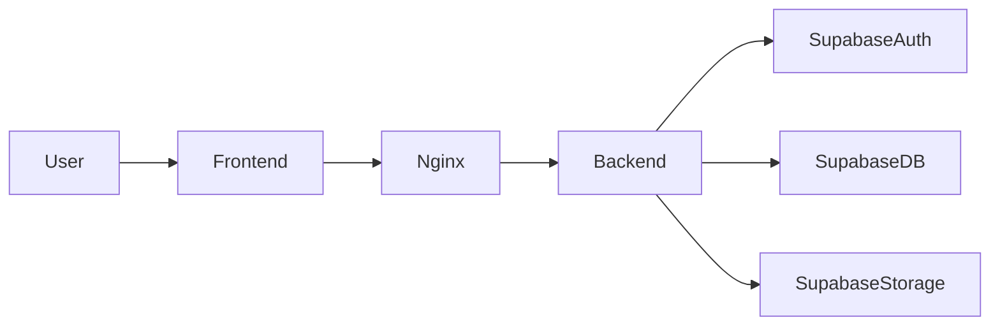
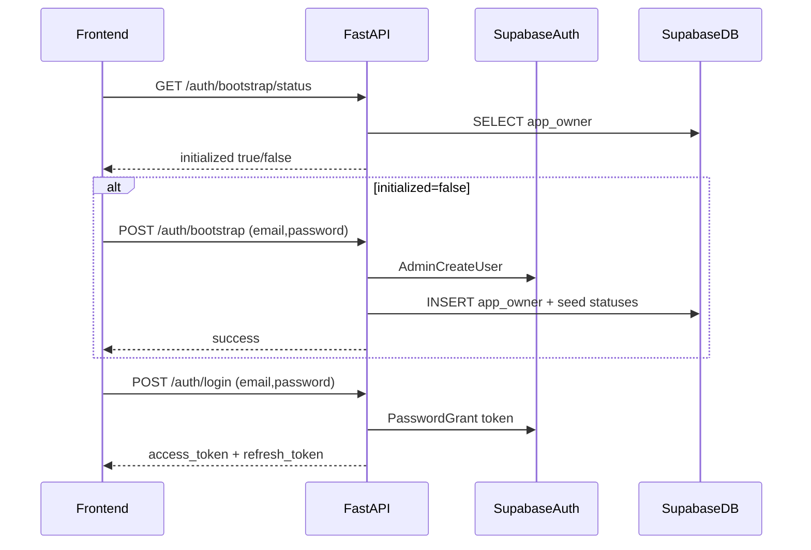

# Personal CRM implementation plan

## Architecture decisions (locked)

- **Supabase access model**: **Backend-only**. React calls FastAPI only.
- **Auth model**: **Supabase Auth**, but **signup is allowed only once** (first launch bootstrap). All later loads go to login.

## Repo layout

- Root
    - [`docker-compose.yaml`](docker-compose.yaml) (ONLY file at root besides README/etc) using Compose `include`
    - [`README.md`](README.md) with local dev steps
    - [`.github/workflows/`](.github/workflows/) CI for frontend/backend lint
- Backend
    - [`backend/docker-compose.yaml`](backend/docker-compose.yaml)
    - [`backend/Dockerfile`](backend/Dockerfile)
    - [`backend/.env`](backend/.env) (untracked) + [`backend/.env.example`](backend/.env.example)
    - [`backend/pyproject.toml`](backend/pyproject.toml) (uv + ruff config)
    - [`backend/src/app/`](backend/src/app/) FastAPI app
- Frontend
    - [`frontend/docker-compose.yaml`](frontend/docker-compose.yaml)
    - [`frontend/Dockerfile`](frontend/Dockerfile) (multi-stage build → Nginx)
    - [`frontend/nginx/default.conf`](frontend/nginx/default.conf)
    - [`frontend/.env`](frontend/.env) (untracked) + [`frontend/.env.example`](frontend/.env.example)
    - [`frontend/package.json`](frontend/package.json)
    - [`frontend/tsconfig.json`](frontend/tsconfig.json) strict
    - [`frontend/eslint.config.*`](frontend/eslint.config.*) strict lint
    - [`frontend/src/`](frontend/src/) React app

## Docker Compose structure (per your requirement)

- Root [`docker-compose.yaml`](docker-compose.yaml) contains only:
```yaml
include:
  - path: "backend/docker-compose.yaml"
    env_file: "backend/.env"
  - path: "frontend/docker-compose.yaml"
    env_file: "frontend/.env"
```

- Backend compose defines `api` service (FastAPI via uvicorn) and any dev helpers (optional).
- Frontend compose defines `web` service (Nginx serving built assets; proxies `/api` to backend).

**Note**: Compose `include` requires recent Docker Compose v2; we’ll document the minimum version in README.

## Backend plan (FastAPI + uv + ruff)

### Tooling

- Use **uv** with lockfile and `uv sync` inside container and CI.
- Use **pydantic-settings** for configuration loaded from `.env`.
- Use **ruff** with your configuration, setting:
    - `target-version = "py312"`

### Ruff configuration

- Put your config verbatim into [`backend/pyproject.toml`](backend/pyproject.toml) under `[tool.ruff]`, `[tool.ruff.format]`, `[tool.ruff.lint]`, etc.
- Enforce full typing (ANN) and docstrings (google convention), with your ignores.

### Supabase integration (backend-only)

- Backend `.env` keys (example):
    - `SUPABASE_URL`
    - `SUPABASE_SERVICE_ROLE_KEY` (server-only)
    - `SUPABASE_JWT_SECRET` (to verify Supabase access tokens locally)
    - `SUPABASE_STORAGE_BUCKET` (e.g. `contact-photos`)

**Credentials setup**

- Use **Supabase MCP** to fetch/configure:
    - Project URL
    - Service role key
    - JWT secret
    - Storage bucket name

(If the Supabase MCP server is not installed in Cursor yet, we’ll add it before implementation.)

### Single-user bootstrap (hard-enforced)

- Create a DB table `app_owner` with a single-row invariant (e.g. PK = constant `id=1`).
- Backend endpoints:
    - `GET /auth/bootstrap/status` → `{ initialized: boolean }`
    - `POST /auth/bootstrap` (only allowed if not initialized)
        - Creates Supabase Auth user (email+password)
        - Inserts `app_owner` row
        - Seeds default `statuses`
    - `POST /auth/login` → exchanges email+password for Supabase access/refresh token via Supabase Auth
    - `POST /auth/logout` (optional) → revoke refresh token
    - `GET /auth/me` → verifies JWT and returns user info

**Enforcement**

- If `app_owner` exists, `POST /auth/bootstrap` always returns 409.
- Backend verifies Supabase JWT on every request and checks the user matches the `app_owner` user id/email.

### Data model (Supabase Postgres)

Proposed normalized schema to support “adjustable lists with suggestions”:

- `contacts`
    - names (name/middle/second)
    - social links (telegram/linkedin/github)
    - dates: `met_at`, `created_at`
    - `status_id`
    - `notes`
    - `photo_path` (storage key)
- Lookup tables (for suggestions + reuse):
    - `tags`, `interests`, `occupations`, `statuses`
- Join tables:
    - `contact_tags`, `contact_interests`, `contact_occupations`
- Associations graph:
    - `contact_associations` (edge: `from_contact_id`, `to_contact_id`, optional `weight/label`)
- Status ordering + visibility:
    - `statuses` contains `sort_order` and an `is_active` flag; Kanban can filter active subset.

We’ll generate SQL migrations under [`backend/supabase/`](backend/supabase/) (or a dedicated `migrations/` folder) and apply them to Supabase.

### API surface (initial)

- Contacts
    - `POST /contacts` create (including optional photo upload workflow)
    - `GET /contacts` list with filters (tags, interests, occupations, status, created_at/met_at ranges)
    - `GET /contacts/{id}`
    - `PATCH /contacts/{id}` update fields
- Statuses / Kanban
    - `GET /statuses`
    - `POST /statuses` create
    - `PATCH /statuses/{id}` rename/update
    - `POST /statuses/reorder` reorder columns left→right
    - `POST /kanban/move` move contact to status + ordering within status
- Suggestions
    - `GET /suggestions/tags?q=` etc.
- Graph
    - `GET /graph` nodes+edges
    - `POST /graph/edge` create association (drag-to-connect)
    - `DELETE /graph/edge/{id}`
    - `POST /graph/clusters/recompute` (initially connected-components; later upgrade to Louvain)

### Photo handling

- Backend endpoint `POST /contacts/{id}/photo` accepts multipart upload and stores into Supabase Storage bucket; saves `photo_path` on contact.
- Backend endpoint `GET /contacts/{id}/photo-url` returns a short-lived signed URL for display.

## Frontend plan (React, strict TypeScript, Nginx)

### Stack

- React + Vite
- Strict TS: `strict: true`, `noImplicitAny: true`, and lint rules to forbid `any`.
- Routing: React Router
- Server state: TanStack Query
- Drag/drop Kanban: `@dnd-kit/*` (typed)
- Graph view: React Flow (typed, supports edge-creation interactions)

### Linting & formatting

- ESLint with `typescript-eslint` in strict mode
- Rules:
    - `@typescript-eslint/no-explicit-any: error`
    - `@typescript-eslint/consistent-type-imports: error`
    - `@typescript-eslint/no-unsafe-*` enabled
- Typecheck in CI with `tsc --noEmit`

### Runtime config via `.env`

- `VITE_API_BASE_URL` (e.g. `http://localhost:8000` or Nginx-proxied `/api`)

### Pages / UX flows

- **First load**
    - Call `GET /auth/bootstrap/status`
    - If not initialized → show **SetupOwner** screen (email+password)
    - If initialized → show **Login** screen
- **After auth**
    - Store access token (and refresh token if used) and attach `Authorization: Bearer <token>` to API calls.

#### Pages you requested

- **AddContact**
    - Form fields as specified, including photo
    - Suggestion inputs backed by `/suggestions/*`
    - Associations picker backed by contacts search
- **Kanban**
    - Columns = statuses sorted by `sort_order`
    - Drag contact cards across columns; reorder within column
    - Filters: created_at range, met_at range, tags, interests, occupations, and (later) association clusters
- **GraphView**
    - Nodes = contacts (photo/icon), edges = associations
    - Click node → open **PersonCard** modal
    - Drag-to-connect creates edge via API
    - Cluster suggestion: initially connected-components; later upgrade algorithm
- **PersonCard modal**
    - Editable fields; save calls `PATCH /contacts/{id}`

## Data flow diagrams

### High-level runtime



### Auth/bootstrap flow



## CI / GitHub Actions

- [`.github/workflows/frontend.yml`](.github/workflows/frontend.yml)
    - install deps
    - `npm run lint`
    - `npm run typecheck`
    - `npm run build`
- [`.github/workflows/backend.yml`](.github/workflows/backend.yml)
    - `uv sync --frozen`
    - `ruff format --check`
    - `ruff check`
    - (optional later) unit tests

## MCP requirements for the implementing agent

- **Context7**: used for fresh docs for FastAPI/uv/pydantic-settings/ruff + React libraries.
- **Supabase MCP**: used to configure and safely inject Supabase project creds and to set up schema/storage.
- **Magic MCP**: used to generate UI elements/components for the frontend.

## Execution milestones

- Milestone A: Docker Compose skeleton + CI green.
- Milestone B: Backend auth/bootstrap + core schema + CRUD contacts.
- Milestone C: Frontend setup/login + AddContact + PersonCard.
- Milestone D: Kanban with drag/drop + filters.
- Milestone E: Graph view + edge creation + basic clustering.